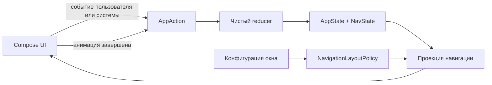
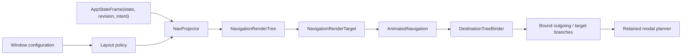

# udf-sandbox

> **Статус:** активный архитектурный эксперимент, который сейчас возрождается. Основная идея выглядит перспективно, но текущая реализация ещё не готова для production.

`udf-sandbox` исследует один вопрос:

> Можно ли представить Android-навигацию как обычное состояние приложения и рендерить её с помощью Jetpack Compose, не отдавая владение историей переходов императивному navigation controller?

Экраны стилизованы под простое банковское приложение, но банковского domain- или data-слоя здесь нет. Они нужны только как понятные fixtures для экспериментов с навигацией, переходами состояния, адаптивным размещением, анимациями и modal UI.

## Что будет считаться успехом

Navigation as state имеет смысл, только если модель навигации:

- детерминирована: одинаковые state и конфигурация окна дают одинаковое видимое UI-дерево;
- явна: push, pop, replace, dismiss и restoration являются обычными переходами состояния;
- тестируется без запуска Compose UI;
- сериализуется и восстанавливается после process death;
- описывает fullscreen-, nested- и modal-destinations;
- не зависит от временного прогресса анимации.

На данном этапе проект не пытается стать универсальной navigation-библиотекой. Это небольшой полигон, на котором свойства подхода можно доказать или опровергнуть.

## Основная идея

Текущий navigation core хранит линейный `NavState.entries`. Каждый `BackStackEntry` содержит стабильный `EntryId` и semantic `Route`, поэтому два появления одного route остаются независимыми. Content- и modal-routes участвуют в одной истории, а чистый `NavProjector` преобразует её и явную `NavigationLayoutPolicy` в immutable `NavigationRenderTree`.

Например, один и тот же state рендерится по-разному без изменения navigation history:

| Логическое состояние | Single-pane projection | Multi-pane projection |
| --- | --- | --- |
| `Home -> Accounts -> Account(1)` | `Accounts` занимает root, поверх открыт account bottom sheet | `Home` остаётся в root, `Accounts` показан во вложенном слоте, поверх открыт тот же sheet |

Layout policy не читает Android configuration: host выбирает её явно и передаёт projector-у. Текущий demo host использует простую orientation heuristic — portrait выбирает single-pane, landscape выбирает expanded-pane; это ещё не полноценная window-size policy. Compose-renderer получает уже готовый `NavigationRenderTree`; screens больше не выбирают placement и получают только явный дочерний content-slot.

## Целевой UDF-цикл



Navigation core уже содержит валидируемую entry model, сохраняемое primitive-представление истории, typed `NavAction`, чистый `NavReducer` и чистую stack-to-layout projection. Activity-scoped `AppViewModel` владеет demo-specific `AppStore`, публикует immutable frames через read-only `StateFlow` и сериализует actions перед reducer. Compose наблюдает flow с учётом lifecycle, проецирует текущий state и передаёт renderer-у атомарный target. Renderer использует отдельную чистую модель retained modal entries, а state-authoritative Material bridge разделяет пользовательский dismiss request и presentation completion.

## Текущее состояние

Прототип уже демонстрирует:

- back stack, хранящийся в state;
- semantic routes и независимую identity каждого back-stack entry;
- непустой stack с content-root и уникальными entry IDs;
- versioned snapshot и расширяемый route codec без Android/Compose dependencies;
- typed push, pop, branch replacement, exact-ID modal dismiss и полную замену history;
- чистый reducer с явными `Changed`/`Unchanged` outcomes;
- transient transition intent, который не попадает в `NavState` или snapshot;
- lifecycle-aware ViewModel и linearizable store как единственную demo-boundary для durable state;
- lifecycle-aware Compose collection и явные callbacks без глобальных state imports в UI;
- чистую stack-to-layout projection с явной application-owned layout policy;
- immutable root-, nested- и modal-слоты с exact-ID ownership modal layers;
- Compose-rendering outgoing и incoming ветвей из их собственных immutable trees;
- process-local revision, которая отличает новый navigation transition от layout reprojection;
- typed destination binding всего дерева до вызова destination composables;
- exhaustive demo-renderers для всех объявленных routes без nullable lookup и `!!`;
- чистую renderer-local модель desired/exiting modal layers с exact generation token для каждого exit;
- независимое завершение пакетно удалённых modal entries без повторного изменения durable navigation state;
- content и modal destinations в одной логической истории;
- вложенный рендеринг в landscape;
- анимированные переходы между content;
- синхронизацию закрытия bottom sheet обратно в navigation state.

Известные ограничения: store остаётся внутренней demo-интеграцией, snapshot не подключён к process-death restoration, а Material bottom-sheet bridge построен поверх старой beta-версии Material 3. Базовый request/completion contract проверен, но cancellation, изменение anchors при resize, recreation и быстрые повторные жесты остаются недоказанными race-сценариями для [issue #15](https://github.com/senneco/udf-sandbox/issues/15). Presentation boundary также пока не стала согласованным library API: `Screen`/`ModalScreen` публичны, но destination catalog и renderer internal, а обязательность вызова `childContent` для screen-владельца вложенного slot не обеспечивается типами. Lifecycle-restoration tests и application-defined animation policy ещё отсутствуют. Подробный baseline, ограничения и целевая архитектура описаны в [контексте проекта](docs/PROJECT_CONTEXT.md).

Базовая модель намеренно читается без framework-specific терминов:

```kotlin
val state = NavState.history(
    root = Home,
    Accounts,
    Account(accountId = 42),
)

val snapshot = state.toSnapshot(DemoRouteCodec)
```

Обычный код отдаёт генерацию identity фабрикам, а restoration и deep links могут передать заранее известные IDs через `NavState.fromEntries(...)`. Пользовательские routes реализуют ровно один из открытых интерфейсов `ContentRoute` или `ModalRoute` и подключают собственный `RouteCodec`.

## Чистая layout projection

Policy является маленьким pure Kotlin-правилом. Single-pane всегда заменяет root, а demo expanded-policy оставляет `Home` видимым и помещает его следующего content-child во вложенный слот:

```kotlin
val singlePane = NavigationLayoutPolicy {
    ContentPlacementDecision.root()
}

val expandedPane = NavigationLayoutPolicy { request ->
    if (request.currentContent.entry.route === Home) {
        ContentPlacementDecision.childOf(request.currentContent.entry.id)
    } else {
        ContentPlacementDecision.root()
    }
}
```

Root создаётся projector-ом автоматически. Policy вызывается только для последующих content entries, поэтому `request.contentPath` всегда непуст, а `request.currentContent` не nullable. Она может выбрать root, существующий slot через `inSlot(...)`, дочерний slot через `childOf(...)` или явно вернуть `reject(code, message)`.

```kotlin
when (val projection = NavProjector.project(state, expandedPane)) {
    is NavProjectionResult.Success -> render(projection.tree)
    is NavProjectionResult.Failure -> report(projection.problem)
}
```

Для `Home -> Accounts -> Account(1)` один `NavState` даёт два дерева без изменения history или entry IDs:

| Policy | Root | Nested slots | Modal layers |
| --- | --- | --- | --- |
| single-pane | `Accounts` | — | `Account(1)`, owner = exact `Accounts` entry ID |
| expanded | `Home` | `ChildOf(Home ID) -> Accounts` | `Account(1)`, owner = тот же exact `Accounts` entry ID |

`NavigationRenderTree` и списки внутри `ContentPlacementRequest` делают defensive unmodifiable copies. Invalid child owner, явный policy reject, exception или Java `null` возвращаются соответственно как `NavProjectionProblem.InvalidSlotOwner`, `PolicyRejected` или `PolicyFailed`, а не как частичное дерево. Структурно невалидная history, включая modal-first, отклоняется раньше через `NavState.fromEntries(...)`.

Projection намеренно не знает о Compose и route-to-screen registry: она размещает любые валидные `ContentRoute`/`ModalRoute`. На renderer boundary `DestinationTreeBinder` атомарно разрешает всё дерево через application-owned catalog. Unsupported route, неверный content/modal kind, exception или Java `null` становятся typed failure до вызова destination composables.

## Compose renderer

Demo host связывает state, layout и presentation в одном направлении:



`navigationRevision` увеличивается только для `NavReduction.Changed`. Она не сериализуется и не хранит animation progress. Renderer-local accepted-target holder живёт в течение lifetime текущей composition и сохраняет последний успешно принятый target только для классификации следующего update. Отдельно Compose transition удерживает outgoing `BoundRenderState` лишь пока выполняется активная exit-анимация. Ни один из этих объектов не попадает в store, `NavState` или snapshot.

Motion выбирается с явной precedence: planner сначала требует уже принятый previous target, ровно следующую revision и изменение visible content-ID path, затем проверяет exact IDs соответствующего intent. Любое невыполненное условие даёт `None`; поэтому modal-only Push или Pop не запускает content-анимацию.

| Изменение | Content motion |
| --- | --- |
| exact contiguous content-changing `Pushed` | slide влево |
| exact contiguous content-changing `Popped` | slide вправо |
| exact contiguous visible `BranchReplaced` / `HistoryReplaced` | fade |
| первый render или renderer/composition recreation | без navigation-анимации |
| та же revision с другой layout projection | без navigation-анимации |
| пропущенная/rollback revision, null или stale/incompatible intent, неизменный visible content path, включая modal-only change | без content-анимации |

Каждая lambda `AnimatedContent` рендерит только переданный ей `branchState.tree`. Поэтому при переходе из expanded `Home -> Accounts -> Account(1)` в `AccountDetails(1)` outgoing-ветка сохраняет собственные `Home`, nested `Accounts` и sheet до конца exit, а incoming-ветка независимо рендерит details. Root и nested content используют точный `BackStackEntry.id` как Compose identity.

Каждая root-ветка также владеет собственным process-local `ModalPresentationState`. При contiguous navigation revision пропавший modal немедленно исчезает из durable `NavState`, но остаётся в renderer-е как `Exiting(entryId, generation)` до завершения именно своей анимации. Пакетные add/remove не теряют соседние layers, одинаковые routes различаются по entry ID, reorder безопасно snap-ится к текущему desired order, а callback со старым generation становится no-op. Candidate presentation вычисляется чисто во время composition и принимается только в `SideEffect`; `onDismissRequest` отправляет exact-ID action reducer-у, тогда как `onExitFinished` меняет только renderer-local presentation.

Bottom-sheet bridge считает presentation state единственным источником истины. Scrim tap и swipe-to-hide только отправляют dismiss request; локальный переход Material в `Hidden` при ещё desired modal отклоняется. Лишь полученный после reducer-а durable `Hidden` запускает suspend `hide()`, после которого phase-scoped guard сообщает completion ровно один раз для этой exit-фазы. Этот доказанный базовый порядок не распространяется автоматически на cancellation, anchor resize, recreation и быстрые повторные gestures из scope #15.

Renderer передаёт каждому content-screen явный `childContent`. Screen, который может стать владельцем `ChildOf(...)`, обязан вызвать эту lambda ровно в нужном месте; текущая demo policy создаёт child только у `Home`, а leaf screens её не вызывают. Этот договор и разрыв между публичными `Screen`/`ModalScreen` и internal catalog/renderer остаются незавершённой demo boundary, а не рекомендуемым consumer API.

Scoped device gate и два landscape-кадра для regression #13 сохранены в [evidence issue #13](docs/evidence/issue-13/README.md). Отдельный gate retained-modal lifecycle, Material bridge и пять portrait-кадров находятся в [evidence issue #14](docs/evidence/issue-14/README.md).

## Переходы состояния

Action factories создают identity нового entry до вызова reducer. Поэтому `NavReducer` не генерирует случайные значения, а одинаковые `state + action` всегда дают одинаковый результат.

```kotlin
object SignedOut : ContentRoute

// Guarded push: stale callback не добавит экран уже в другую ветку.
val pushed = NavReducer.reduce(
    state,
    NavAction.push(state.top.id, AccountDetails(accountId = 42)),
)

// Android Back удаляет ровно верхний entry и безопасно останавливается на root.
val back = NavReducer.reduce(pushed.state, NavAction.Pop)

// Если Home не top, NavigateFrom удаляет его descendants и создаёт новую ветку.
val branch = NavReducer.reduce(
    state,
    NavAction.navigateFrom(state.root.id, Transactions),
)

// Dismiss адресует одно конкретное появление modal route.
val accountEntry = state.entries.first { it.route is Account }
val dismissed = NavReducer.reduce(
    state,
    NavAction.dismissModal(accountEntry.id),
)

// Logout и deep link заменяют history атомарно, без серии промежуточных Push.
val logout = NavReducer.reduce(state, NavAction.resetTo(SignedOut))
val deepLink = NavReducer.reduce(
    state,
    NavAction.replaceHistory(
        NavState.history(
            root = Home,
            Accounts,
            Account(accountId = 42),
            AccountDetails(accountId = 42),
        ),
    ),
)
```

`NavigateFrom` работает как guarded push, когда source уже является top, и как branch replacement, когда после source есть descendants. Отсутствующий или устаревший ID, повторный dismiss и попытка удалить root возвращают тот же `NavState` внутри `NavReduction.Unchanged`; reducer не перенаправляет action на «похожий» route.

`ReplaceHistory` может сохранить старый entry ID только вместе с тем же semantic route. Для новых logout- или deep-link-occurrences используйте свежие IDs; попытка связать прежний ID с другим route возвращает typed `Unchanged`.

`NavTransitionIntent` существует только в `NavReduction.Changed`. Это описание совершившегося перехода для будущего renderer/animation policy, а не часть долгоживущего state:

```kotlin
when (val reduction = NavReducer.reduce(state, action)) {
    is NavReduction.Changed -> {
        reduction.state
        reduction.transition
    }
    is NavReduction.Unchanged -> {
        reduction.state // тот же instance
        reduction.reason
    }
}
```

## Lifecycle-aware host

Demo host не является частью публичного navigation core. Он показывает минимальную Android-границу: `AppStore` атомарно публикует immutable `AppState`, process-local revision и transition metadata одним `AppStateFrame`, а `AppViewModel` удерживает store в lifecycle конкретной Activity.

```kotlin
private val appViewModel: AppViewModel by viewModels()

setContent {
    val frame by appViewModel.frames.collectAsStateWithLifecycle()
    val policy = selectPolicy(LocalConfiguration.current)

    when (val result = NavProjector.project(frame.appState.navState, policy)) {
        is NavProjectionResult.Success -> AnimatedNavigation(
            renderTarget = NavigationRenderTarget(
                navigationRevision = frame.navigationRevision,
                tree = result.tree,
                transitionIntent = frame.navigationTransition,
            ),
            onNavigationAction = appViewModel::dispatch,
        )
        is NavProjectionResult.Failure -> showProjectionFailure(result.problem)
    }
}
```

`dispatch` всегда применяет action к последнему committed state под одной короткой критической секцией. `Changed` публикует один согласованный frame и увеличивает revision, а `Unchanged` сохраняет тот же frame instance. Transition — process-local metadata текущего frame, sticky до следующего `Changed`; он не является pending event и не восстанавливается из snapshot. Initial render, renderer/composition recreation — включая Activity configuration recreation с сохранённым ViewModel — layout-only reprojection и пропуск промежуточного frame не переигрывают этот intent. Это не означает process-death restoration: после смерти процесса demo всё ещё создаёт hard-coded начальную history.

## Карта кода

- [`AppState.kt`](app/src/main/java/com/shmakov/udf/AppState.kt), [`AppStore.kt`](app/src/main/java/com/shmakov/udf/AppStore.kt) и [`AppViewModel.kt`](app/src/main/java/com/shmakov/udf/AppViewModel.kt) — immutable application state, linearizable store и Activity-scoped lifecycle owner.
- [`UdfApp.kt`](app/src/main/java/com/shmakov/udf/UdfApp.kt) — только application initialization и logging; navigation state там не хранится.
- [`navigation/`](app/src/main/java/com/shmakov/udf/navigation) — routes, back-stack entries, валидируемый navigation state, actions/reducer, snapshot/codec и screen abstractions.
- [`NavigationProjection.kt`](app/src/main/java/com/shmakov/udf/navigation/NavigationProjection.kt) — pure Kotlin layout policy, immutable render tree и typed projection results.
- [`NavigationPresentation.kt`](app/src/main/java/com/shmakov/udf/NavigationPresentation.kt) — renderer-target, exact-intent validation и выбор content motion.
- [`ModalPresentation.kt`](app/src/main/java/com/shmakov/udf/ModalPresentation.kt) — чистый retained-modal planner, generation tokens и safe reorder fallback.
- [`DestinationTreeBinding.kt`](app/src/main/java/com/shmakov/udf/composable/common/DestinationTreeBinding.kt) — атомарный typed route-to-screen binding всего projected tree.
- [`AnimatedNavigation.kt`](app/src/main/java/com/shmakov/udf/composable/common/AnimatedNavigation.kt) — recursive root/nested rendering из branch-owned trees, entry-ID keys, content transitions и branch-owned modal presentation.
- [`BottomSheetLayout.kt`](app/src/main/java/com/shmakov/udf/composable/common/BottomSheetLayout.kt) — state-authoritative request/hide/completion bridge к Material bottom sheet.
- [`composable/screen/`](app/src/main/java/com/shmakov/udf/composable/screen) — destination adapters с typed actions и явным `childContent` slot.
- [`composable/content/`](app/src/main/java/com/shmakov/udf/composable/content) — минимальный demo UI и текущие navigation triggers.

## Roadmap и задачи

GitHub Issues — единственный источник истины для запланированной работы и её статуса. Начните с [roadmap возрождения Navigation as State](https://github.com/senneco/udf-sandbox/issues/7): в нём задачи расположены по фазам и зависимостям.

Документация объясняет долгоживущие цели и решения, но не дублирует актуальные task checklists.

## Локальный запуск

Требования:

- Android Studio и Android SDK, соответствующий конфигурации проекта;
- JDK 17;
- Gradle Wrapper из репозитория.

Запустите конфигурацию `app` в Android Studio или выполните проверку из терминала:

```bash
./gradlew testDebugUnitTest lintDebug assembleDebug
```

Перед началом работы прочитайте [CONTRIBUTING.md](CONTRIBUTING.md). Изменения navigation behavior должны сопровождаться сфокусированными тестами переходов состояния, а видимые UI-изменения — скриншотами или короткой записью.
