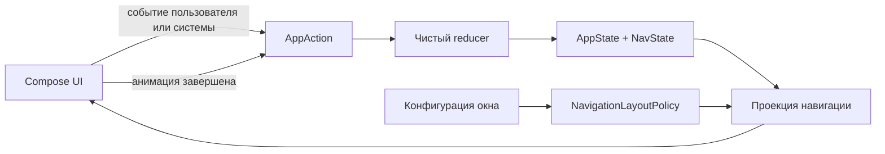

# udf-sandbox

> **Статус:** активный архитектурный эксперимент, который сейчас возрождается. Основная идея выглядит перспективно, но текущая реализация ещё не готова для production.

`udf-sandbox` исследует один вопрос:

> Можно ли представить Android-навигацию как обычное состояние приложения и рендерить её с помощью Jetpack Compose, не отдавая владение историей переходов императивному navigation controller?

Экраны стилизованы под простое банковское приложение, но банковского domain- или data-слоя здесь нет. Они нужны только как понятные fixtures для экспериментов с навигацией, переходами состояния, адаптивным размещением, анимациями и modal UI.

## Что будет считаться успехом

Navigation as state имеет смысл, только если модель навигации:

- детерминирована: одинаковые state и конфигурация окна дают одинаковое видимое UI-дерево;
- явна: push, pop, replace, dismiss и restoration являются обычными переходами состояния;
- тестируется без запуска Compose UI;
- сериализуется и восстанавливается после process death;
- описывает fullscreen-, nested- и modal-destinations;
- не зависит от временного прогресса анимации.

На данном этапе проект не пытается стать универсальной navigation-библиотекой. Это небольшой полигон, на котором свойства подхода можно доказать или опровергнуть.

## Основная идея

Текущий navigation core хранит линейный `NavState.entries`. Каждый `BackStackEntry` содержит стабильный `EntryId` и semantic `Route`, поэтому два появления одного route остаются независимыми. Content- и modal-routes участвуют в одной истории, а чистый `NavProjector` преобразует её и явную `NavigationLayoutPolicy` в immutable `NavigationRenderTree`.

Например, один и тот же state рендерится по-разному без изменения navigation history:

| Логическое состояние | Single-pane projection | Multi-pane projection |
| --- | --- | --- |
| `Home -> Accounts -> Account(1)` | `Accounts` занимает root, поверх открыт account bottom sheet | `Home` остаётся в root, `Accounts` показан во вложенном слоте, поверх открыт тот же sheet |

Layout policy не читает Android configuration: host выбирает её по доступному пространству и передаёт явно. Compose-renderer пока ещё использует legacy `HomeScreen.whereToShowChild` и orientation; подключение `NavigationRenderTree` вместо этого fold относится к [#13](https://github.com/senneco/udf-sandbox/issues/13).

## Целевой UDF-цикл



Navigation core уже содержит валидируемую entry model, сохраняемое primitive-представление истории, typed `NavAction`, чистый `NavReducer` и чистую stack-to-layout projection. Activity-scoped `AppViewModel` владеет demo-specific `AppStore`, публикует immutable frames через read-only `StateFlow` и сериализует actions перед reducer. Compose наблюдает flow с учётом lifecycle и передаёт события наверх через явные callbacks. Следующий архитектурный шаг — перевести renderer на отдельные previous и target projections.

## Текущее состояние

Прототип уже демонстрирует:

- back stack, хранящийся в state;
- semantic routes и независимую identity каждого back-stack entry;
- непустой stack с content-root и уникальными entry IDs;
- versioned snapshot и расширяемый route codec без Android/Compose dependencies;
- typed push, pop, branch replacement, exact-ID modal dismiss и полную замену history;
- чистый reducer с явными `Changed`/`Unchanged` outcomes;
- transient transition intent, который не попадает в `NavState` или snapshot;
- lifecycle-aware ViewModel и linearizable store как единственную demo-boundary для durable state;
- lifecycle-aware Compose collection и явные callbacks без глобальных state imports в UI;
- чистую stack-to-layout projection с явной application-owned layout policy;
- immutable root-, nested- и modal-слоты с exact-ID ownership modal layers;
- content и modal destinations в одной логической истории;
- вложенный рендеринг в landscape;
- анимированные переходы между content;
- синхронизацию закрытия bottom sheet обратно в navigation state.

Известные ограничения: store пока является внутренней demo-интеграцией, snapshot не подключён к process-death restoration, а Compose-renderer ещё не потребляет чистую projection. Неполная регистрация routes и legacy modal bookkeeping также остаются внутри renderer; lifecycle-restoration tests ещё отсутствуют. Подробный baseline, ограничения и целевая архитектура описаны в [контексте проекта](docs/PROJECT_CONTEXT.md).

Базовая модель намеренно читается без framework-specific терминов:

```kotlin
val state = NavState.history(
    root = Home,
    Accounts,
    Account(accountId = 42),
)

val snapshot = state.toSnapshot(DemoRouteCodec)
```

Обычный код отдаёт генерацию identity фабрикам, а restoration и deep links могут передать заранее известные IDs через `NavState.fromEntries(...)`. Пользовательские routes реализуют ровно один из открытых интерфейсов `ContentRoute` или `ModalRoute` и подключают собственный `RouteCodec`.

## Чистая layout projection

Policy является маленьким pure Kotlin-правилом. Single-pane всегда заменяет root, а demo expanded-policy оставляет `Home` видимым и помещает его следующего content-child во вложенный слот:

```kotlin
val singlePane = NavigationLayoutPolicy {
    ContentPlacementDecision.root()
}

val expandedPane = NavigationLayoutPolicy { request ->
    if (request.currentContent.entry.route === Home) {
        ContentPlacementDecision.childOf(request.currentContent.entry.id)
    } else {
        ContentPlacementDecision.root()
    }
}
```

Root создаётся projector-ом автоматически. Policy вызывается только для последующих content entries, поэтому `request.contentPath` всегда непуст, а `request.currentContent` не nullable. Она может выбрать root, существующий slot через `inSlot(...)`, дочерний slot через `childOf(...)` или явно вернуть `reject(code, message)`.

```kotlin
when (val projection = NavProjector.project(state, expandedPane)) {
    is NavProjectionResult.Success -> render(projection.tree)
    is NavProjectionResult.Failure -> report(projection.problem)
}
```

Для `Home -> Accounts -> Account(1)` один `NavState` даёт два дерева без изменения history или entry IDs:

| Policy | Root | Nested slots | Modal layers |
| --- | --- | --- | --- |
| single-pane | `Accounts` | — | `Account(1)`, owner = exact `Accounts` entry ID |
| expanded | `Home` | `ChildOf(Home ID) -> Accounts` | `Account(1)`, owner = тот же exact `Accounts` entry ID |

`NavigationRenderTree` и списки внутри `ContentPlacementRequest` делают defensive unmodifiable copies. Invalid child owner, явный policy reject, exception или Java `null` возвращаются соответственно как `NavProjectionProblem.InvalidSlotOwner`, `PolicyRejected` или `PolicyFailed`, а не как частичное дерево. Структурно невалидная history, включая modal-first, отклоняется раньше через `NavState.fromEntries(...)`.

Projection намеренно не знает о Compose и route-to-screen registry: она размещает любые валидные `ContentRoute`/`ModalRoute`. Exhaustive destination binding и фактическое потребление дерева renderer-ом относятся к [#13](https://github.com/senneco/udf-sandbox/issues/13).

## Переходы состояния

Action factories создают identity нового entry до вызова reducer. Поэтому `NavReducer` не генерирует случайные значения, а одинаковые `state + action` всегда дают одинаковый результат.

```kotlin
object SignedOut : ContentRoute

// Guarded push: stale callback не добавит экран уже в другую ветку.
val pushed = NavReducer.reduce(
    state,
    NavAction.push(state.top.id, AccountDetails(accountId = 42)),
)

// Android Back удаляет ровно верхний entry и безопасно останавливается на root.
val back = NavReducer.reduce(pushed.state, NavAction.Pop)

// Если Home не top, NavigateFrom удаляет его descendants и создаёт новую ветку.
val branch = NavReducer.reduce(
    state,
    NavAction.navigateFrom(state.root.id, Transactions),
)

// Dismiss адресует одно конкретное появление modal route.
val accountEntry = state.entries.first { it.route is Account }
val dismissed = NavReducer.reduce(
    state,
    NavAction.dismissModal(accountEntry.id),
)

// Logout и deep link заменяют history атомарно, без серии промежуточных Push.
val logout = NavReducer.reduce(state, NavAction.resetTo(SignedOut))
val deepLink = NavReducer.reduce(
    state,
    NavAction.replaceHistory(
        NavState.history(
            root = Home,
            Accounts,
            Account(accountId = 42),
            AccountDetails(accountId = 42),
        ),
    ),
)
```

`NavigateFrom` работает как guarded push, когда source уже является top, и как branch replacement, когда после source есть descendants. Отсутствующий или устаревший ID, повторный dismiss и попытка удалить root возвращают тот же `NavState` внутри `NavReduction.Unchanged`; reducer не перенаправляет action на «похожий» route.

`ReplaceHistory` может сохранить старый entry ID только вместе с тем же semantic route. Для новых logout- или deep-link-occurrences используйте свежие IDs; попытка связать прежний ID с другим route возвращает typed `Unchanged`.

`NavTransitionIntent` существует только в `NavReduction.Changed`. Это описание совершившегося перехода для будущего renderer/animation policy, а не часть долгоживущего state:

```kotlin
when (val reduction = NavReducer.reduce(state, action)) {
    is NavReduction.Changed -> {
        reduction.state
        reduction.transition
    }
    is NavReduction.Unchanged -> {
        reduction.state // тот же instance
        reduction.reason
    }
}
```

## Lifecycle-aware host

Demo host не является частью публичного navigation core. Он показывает минимальную Android-границу: `AppStore` атомарно публикует immutable `AppState` и transition metadata одним `AppStateFrame`, а `AppViewModel` удерживает store в lifecycle конкретной Activity.

```kotlin
private val appViewModel: AppViewModel by viewModels()

setContent {
    val frame by appViewModel.frames.collectAsStateWithLifecycle()

    AnimatedNavigation(
        navState = frame.appState.navState,
        navTransition = frame.navigationTransition,
        onNavigationAction = { action -> appViewModel.dispatch(action) },
    )
}
```

`dispatch` всегда применяет action к последнему committed state под одной короткой критической секцией. `Changed` публикует один согласованный frame, а `Unchanged` сохраняет тот же frame instance и не создаёт ложную анимацию. Transition — process-local metadata текущего frame, sticky до следующего `Changed`; он не является pending event и не восстанавливается из snapshot.

## Карта кода

- [`AppState.kt`](app/src/main/java/com/shmakov/udf/AppState.kt), [`AppStore.kt`](app/src/main/java/com/shmakov/udf/AppStore.kt) и [`AppViewModel.kt`](app/src/main/java/com/shmakov/udf/AppViewModel.kt) — immutable application state, linearizable store и Activity-scoped lifecycle owner.
- [`UdfApp.kt`](app/src/main/java/com/shmakov/udf/UdfApp.kt) — только application initialization и logging; navigation state там не хранится.
- [`navigation/`](app/src/main/java/com/shmakov/udf/navigation) — routes, back-stack entries, валидируемый navigation state, actions/reducer, snapshot/codec и screen abstractions.
- [`NavigationProjection.kt`](app/src/main/java/com/shmakov/udf/navigation/NavigationProjection.kt) — pure Kotlin layout policy, immutable render tree и typed projection results.
- [`AnimatedNavigation.kt`](app/src/main/java/com/shmakov/udf/composable/common/AnimatedNavigation.kt) — legacy stack fold, вложенный Compose-rendering, content transitions и modal bookkeeping; пока не переведён на `NavigationRenderTree`.
- [`BottomSheetLayout.kt`](app/src/main/java/com/shmakov/udf/composable/common/BottomSheetLayout.kt) — временное animation state bottom sheet.
- [`composable/screen/`](app/src/main/java/com/shmakov/udf/composable/screen) — адаптеры экранов и правила размещения дочернего content.
- [`composable/content/`](app/src/main/java/com/shmakov/udf/composable/content) — минимальный demo UI и текущие navigation triggers.

## Roadmap и задачи

GitHub Issues — единственный источник истины для запланированной работы и её статуса. Начните с [roadmap возрождения Navigation as State](https://github.com/senneco/udf-sandbox/issues/7): в нём задачи расположены по фазам и зависимостям.

Документация объясняет долгоживущие цели и решения, но не дублирует актуальные task checklists.

## Локальный запуск

Требования:

- Android Studio и Android SDK, соответствующий конфигурации проекта;
- JDK 17;
- Gradle Wrapper из репозитория.

Запустите конфигурацию `app` в Android Studio или выполните проверку из терминала:

```bash
./gradlew testDebugUnitTest lintDebug assembleDebug
```

Перед началом работы прочитайте [CONTRIBUTING.md](CONTRIBUTING.md). Изменения navigation behavior должны сопровождаться сфокусированными тестами переходов состояния, а видимые UI-изменения — скриншотами или короткой записью.
