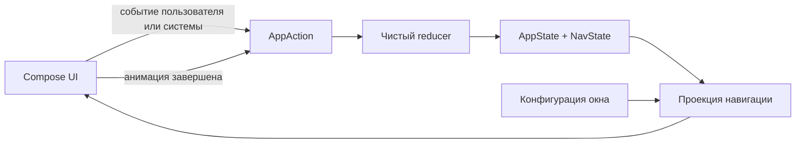

# udf-sandbox

> **Статус:** активный архитектурный эксперимент, который сейчас возрождается. Основная идея выглядит перспективно, но текущая реализация ещё не готова для production.

`udf-sandbox` исследует один вопрос:

> Можно ли представить Android-навигацию как обычное состояние приложения и рендерить её с помощью Jetpack Compose, не отдавая владение историей переходов императивному navigation controller?

Экраны стилизованы под простое банковское приложение, но банковского domain- или data-слоя здесь нет. Они нужны только как понятные fixtures для экспериментов с навигацией, переходами состояния, адаптивным размещением, анимациями и modal UI.

## Что будет считаться успехом

Navigation as state имеет смысл, только если модель навигации:

- детерминирована: одинаковые state и конфигурация окна дают одинаковое видимое UI-дерево;
- явна: push, pop, replace, dismiss и restoration являются обычными переходами состояния;
- тестируется без запуска Compose UI;
- сериализуется и восстанавливается после process death;
- описывает fullscreen-, nested- и modal-destinations;
- не зависит от временного прогресса анимации.

На данном этапе проект не пытается стать универсальной navigation-библиотекой. Это небольшой полигон, на котором свойства подхода можно доказать или опровергнуть.

## Основная идея

Текущий прототип хранит линейный `NavState.entries`. Каждый `BackStackEntry` содержит стабильный `EntryId` и semantic `Route`, поэтому два появления одного route остаются независимыми. Content- и modal-routes участвуют в одной истории, а `AnimatedNavigation` проецирует её в один или несколько UI-слотов.

Например, один и тот же state рендерится по-разному без изменения navigation history:

| Логическое состояние | Single-pane projection | Multi-pane projection |
| --- | --- | --- |
| `Home -> Accounts -> Account(1)` | `Accounts` занимает root, поверх открыт account bottom sheet | `Home` остаётся в root, `Accounts` показан во вложенном слоте, поверх открыт тот же sheet |

Сейчас `HomeScreen.whereToShowChild` приближённо сопоставляет single-pane с portrait, а multi-pane — с landscape. Это demo-упрощение: в целевой архитектуре layout policy станет явным аргументом чистой функции проекции и не будет выводиться только из orientation.

## Целевой UDF-цикл



Текущий код уже реализует направление `state -> UI`, валидируемую entry model и сохраняемое primitive-представление истории. Callbacks из UI пока напрямую изменяют глобальный `appState`. Следующий архитектурный шаг — ввести typed actions и чистый reducer, а затем lifecycle-aware store и чистую layout projection.

## Текущее состояние

Прототип уже демонстрирует:

- back stack, хранящийся в state;
- semantic routes и независимую identity каждого back-stack entry;
- непустой stack с content-root и уникальными entry IDs;
- versioned snapshot и расширяемый route codec без Android/Compose dependencies;
- push, pop и замену текущей ветки;
- content и modal destinations в одной логической истории;
- вложенный рендеринг в landscape;
- анимированные переходы между content;
- синхронизацию закрытия bottom sheet обратно в navigation state.

Известные ограничения: распределённые мутации state, неполная регистрация routes, хрупкий modal bookkeeping, отсутствие подключения snapshot к process-death restoration и отсутствие reducer-, projection- и UI-тестов. Подробный baseline, ограничения и целевая архитектура описаны в [контексте проекта](docs/PROJECT_CONTEXT.md).

Базовая модель намеренно читается без framework-specific терминов:

```kotlin
val state = NavState.history(
    root = Home,
    Accounts,
    Account(accountId = 42),
)

val snapshot = state.toSnapshot(DemoRouteCodec)
```

Обычный код отдаёт генерацию identity фабрикам, а restoration и deep links могут передать заранее известные IDs через `NavState.fromEntries(...)`. Пользовательские routes реализуют ровно один из открытых интерфейсов `ContentRoute` или `ModalRoute` и подключают собственный `RouteCodec`.

## Карта кода

- [`AppState.kt`](app/src/main/java/com/shmakov/udf/AppState.kt) и [`UdfApp.kt`](app/src/main/java/com/shmakov/udf/UdfApp.kt) — текущий глобальный владелец state и начальное demo-состояние.
- [`navigation/`](app/src/main/java/com/shmakov/udf/navigation) — routes, back-stack entries, валидируемый navigation state, snapshot/codec и screen abstractions.
- [`AnimatedNavigation.kt`](app/src/main/java/com/shmakov/udf/composable/common/AnimatedNavigation.kt) — проекция стека, вложенный рендеринг, content transitions и modal bookkeeping.
- [`BottomSheetLayout.kt`](app/src/main/java/com/shmakov/udf/composable/common/BottomSheetLayout.kt) — временное animation state bottom sheet.
- [`composable/screen/`](app/src/main/java/com/shmakov/udf/composable/screen) — адаптеры экранов и правила размещения дочернего content.
- [`composable/content/`](app/src/main/java/com/shmakov/udf/composable/content) — минимальный demo UI и текущие navigation triggers.

## Roadmap и задачи

GitHub Issues — единственный источник истины для запланированной работы и её статуса. Начните с [roadmap возрождения Navigation as State](https://github.com/senneco/udf-sandbox/issues/7): в нём задачи расположены по фазам и зависимостям.

Документация объясняет долгоживущие цели и решения, но не дублирует актуальные task checklists.

## Локальный запуск

Требования:

- Android Studio и Android SDK, соответствующий конфигурации проекта;
- JDK 17;
- Gradle Wrapper из репозитория.

Запустите конфигурацию `app` в Android Studio или выполните проверку из терминала:

```bash
./gradlew testDebugUnitTest lintDebug assembleDebug
```

Перед началом работы прочитайте [CONTRIBUTING.md](CONTRIBUTING.md). Изменения navigation behavior должны сопровождаться сфокусированными тестами переходов состояния, а видимые UI-изменения — скриншотами или короткой записью.
