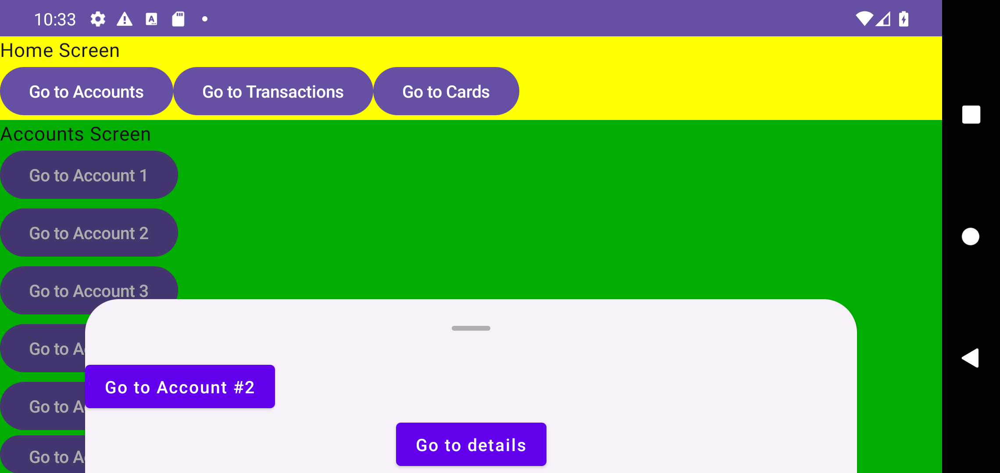
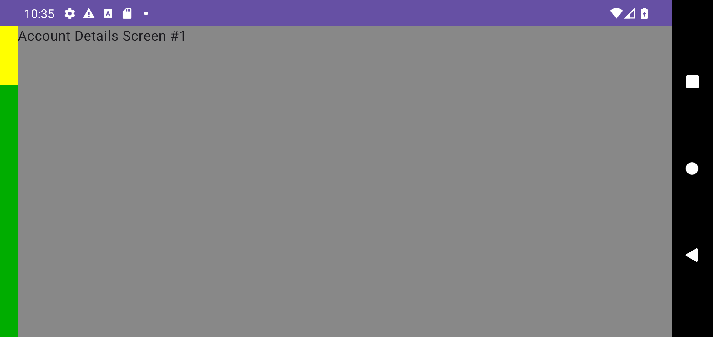

# Issue #13: Compose renderer evidence

Эта проверка изолирует regression `AnimatedNavigation`: outgoing expanded-ветка должна сохранить собственные `Home`, nested `Accounts` и account sheet, пока incoming `AccountDetails` выполняет push-анимацию.

## Scoped device gate

Проверка выполнена на отдельном emulator с serial `emulator-5560`; общий `emulator-5554` не использовался. Запускается только класс `com.shmakov.udf.composable.common.AnimatedNavigationRegressionTest`:

```bash
./gradlew assembleDebug assembleDebugAndroidTest
adb -s emulator-5560 install -r app/build/outputs/apk/debug/app-debug.apk
adb -s emulator-5560 install -r app/build/outputs/apk/androidTest/debug/app-debug-androidTest.apk
adb -s emulator-5560 shell am instrument -w -r -e class com.shmakov.udf.composable.common.AnimatedNavigationRegressionTest com.shmakov.udf.test/androidx.test.runner.AndroidJUnitRunner
```

Результат:

```text
OK (2 tests)
```

Тесты фиксируют два свойства:

1. Во время push exit одновременно существуют outgoing `Home`, nested `Accounts`, account modal и incoming `AccountDetails`; после завершения остаётся только target.
2. Sticky intent не переигрывается на initial render и при same-revision single-to-expanded reprojection.

## Landscape evidence

### Initial expanded projection

[](initial-expanded.png)

`initial-expanded.png` показывает исходную expanded projection: жёлтый `Home` остаётся root, зелёный `Accounts` занимает вложенный slot, а account sheet открыт поверх них.

### Push mid-transition

[](push-mid-transition.png)

`push-mid-transition.png` снят во время push в `AccountDetails`: incoming серый details-content уже виден, а слева ещё присутствуют жёлтая и зелёная части outgoing `Home`/`Accounts`. Наличие outgoing account modal в этот же момент дополнительно проверяет instrumentation assertion по exact entry ID.
