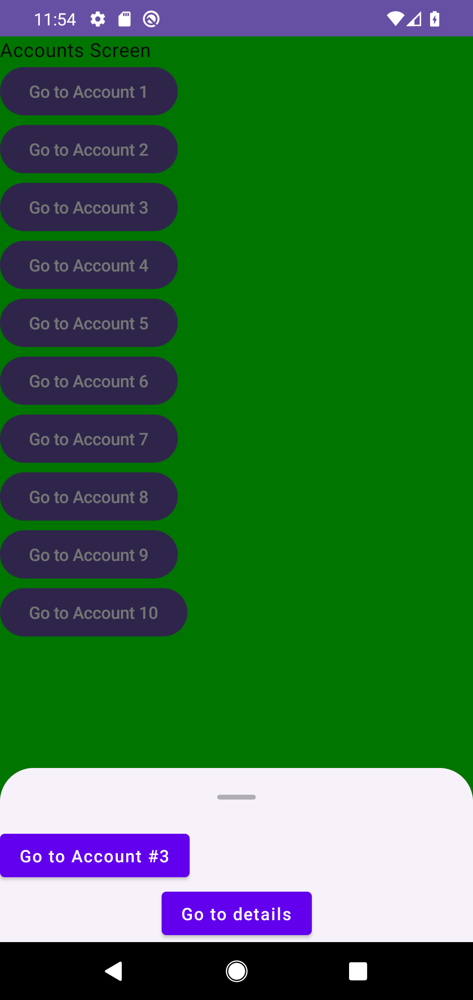
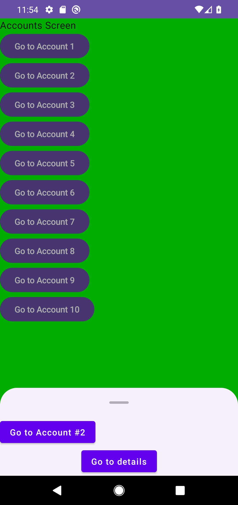
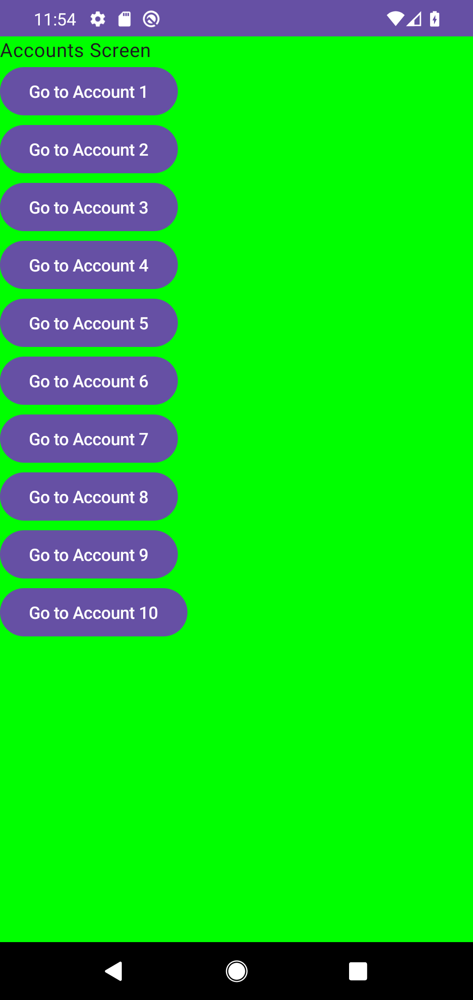

# Issue #14: retained modal и bottom-sheet evidence

Эта проверка фиксирует две связанные границы: exact-ID retained-modal lifecycle внутри `AnimatedNavigation` и state-authoritative request/hide/completion handshake между durable navigation state и Material bottom sheet.

## Окружение

Проверка выполнена на изолированном `emulator-5560`, AVD `Pixel_4`, API 29. Общий `emulator-5554` не использовался и не изменялся.

## Scoped instrumentation gate

Запускались только два класса:

- `com.shmakov.udf.composable.common.AnimatedNavigationRegressionTest`;
- `com.shmakov.udf.composable.common.BottomSheetLayoutRegressionTest`.

```bash
adb -s emulator-5560 shell am instrument -w -r \
  -e class com.shmakov.udf.composable.common.AnimatedNavigationRegressionTest,com.shmakov.udf.composable.common.BottomSheetLayoutRegressionTest \
  com.shmakov.udf.test/androidx.test.runner.AndroidJUnitRunner
```

Результат:

```text
OK (8 tests)
```

Эти восемь тестов проверяют branch-owned content и modal presentation, batch removal, stale/duplicate/ABA completion, initial и rapid `Shown -> Hidden` lifecycle, разделение dismiss request и completion, а также phase-scoped exactly-once completion.

## Maestro smoke flow

На том же `emulator-5560` выполнен flow из 15 Maestro-команд; все 15 завершились успешно. Последовательность:

1. очистить состояние приложения и выполнить чистый launch;
2. закрыть первый sheet tap-ом по scrim;
3. снова открыть первый account sheet;
4. из него добавить второй sheet;
5. закрыть верхний sheet и увидеть оставшийся нижний;
6. закрыть оставшийся sheet.

Это smoke evidence реального UI-пути. Generation-token и exactly-once свойства доказываются scoped instrumentation assertions, а не сравнением PNG.

## Кадры

### Исходный modal

[](modal-shown.png)

`modal-shown.png` показывает исходный account sheet поверх `Accounts`: durable history содержит modal entry, а renderer показывает его как `Shown`.

### Повторное открытие после scrim dismiss

[](scrim-dismiss-reopen.png)

`scrim-dismiss-reopen.png` снят после scrim request, завершения durable dismiss и повторного открытия. Sheet снова полностью интерактивен; предыдущая exit-фаза не оставила невидимый retained layer.

### Два modal entries

[](two-modal-stack.png)

`two-modal-stack.png` показывает верхний второй sheet после push из первого. Визуально верхний layer закрывает нижний; независимые exact entry IDs и наличие обоих layers дополнительно проверяются instrumentation test.

### Верхний modal закрыт

[](top-modal-dismissed.png)

`top-modal-dismissed.png` фиксирует exact-ID dismiss только верхнего entry: нижний sheet остаётся и снова становится видимым.

### Все modal entries закрыты

[](modal-dismissed.png)

`modal-dismissed.png` показывает финальное состояние flow: оставшийся modal удалён, scrim и sheet отсутствуют, а `Accounts` доступен без невидимого presentation overlay.
