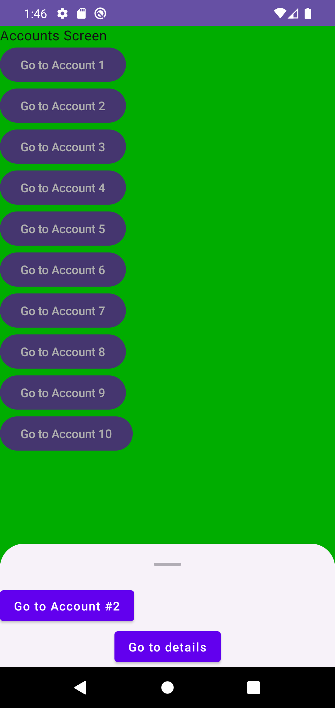
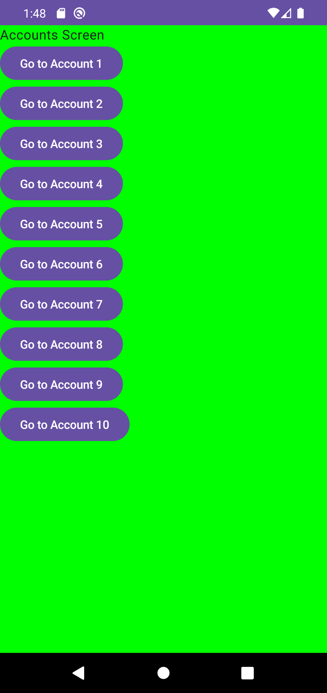
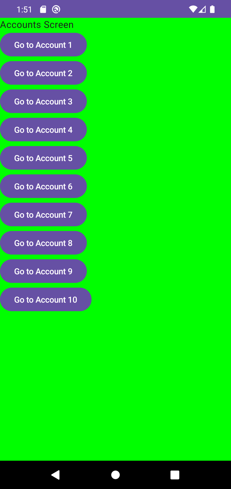

# Issue #15: bottom-sheet race evidence

Эта проверка фиксирует state-authoritative границу между durable modal entry, физическим состоянием Material sheet и renderer-local завершением exact exit token.

## Окружение

Проверка выполнена на отдельном `emulator-5560`, AVD `Pixel_4`, API 29. Общий `emulator-5554` не использовался и не изменялся. Maestro обнаружил устройство, но его device server завершился с `UNAVAILABLE`, поэтому для этого gate использовались только адресные команды `adb -s emulator-5560`.

## Gradle gate

```bash
./gradlew testDebugUnitTest lintDebug assembleDebug assembleDebugAndroidTest
```

Результат: `BUILD SUCCESSFUL`. JVM suite содержит 155 тестов без failures, errors или skips. Помимо остальных contract suites, она проверяет exact modal Back, phase identity, once-gates, повтор внутренне отменённой Material mutation и запрет stale completion после cancellation родительской фазы.

## Полный instrumentation gate

```bash
adb -s emulator-5560 shell am instrument -w -r \
  com.shmakov.udf.test/androidx.test.runner.AndroidJUnitRunner
```

Результат:

```text
Time: 13.038

OK (18 tests)
```

В gate входят 10 `BottomSheetLayoutRegressionTest`, 7 `AnimatedNavigationRegressionTest` и один `MainActivityBackRegressionTest`. Они проверяют mid-show durable removal, delayed ack, один request для scrim/swipe/accessibility за фазу, state-authoritative возврат в exact `Expanded` geometry, resize и sheet-geometry churn, exact completion, retained-modal ABA, branch isolation, замену exiting sheet A новым exact-ID sheet B на реальном Material boundary и два Back подряд до recomposition.

## Реальные UI-пути

Перед каждым результатом accessibility tree подтверждал exact экран; для закрытых состояний он отдельно подтверждал отсутствие modal controls. Скриншоты сняты с того же финального APK.

### Исходный account sheet

[](modal-shown.png)

`modal-shown.png` показывает durable modal entry в принятой `Shown`-фазе.

### Два быстрых Android Back

[](after-back.png)

Два Back были отправлены в одном UI turn. Первый exact-ID dismiss удалил modal, второй stale replay стал reducer no-op: `Accounts` остался текущим content, а underlying history не была дополнительно изменена.

### Реальный swipe-down

[](after-swipe.png)

Sheet был повторно открыт и закрыт реальным жестом от drag-handle вниз. После сходимости accessibility tree содержал `Accounts Screen` и не содержал `Go to details`/`Go to Account #2`: swipe запросил durable exact-ID dismiss, а exit completion не создал вторую navigation action.
