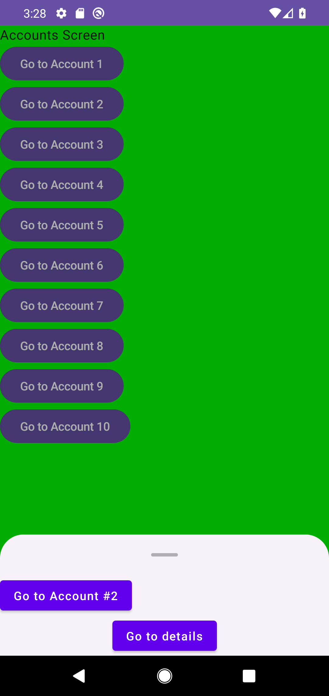

# Issue #16: navigation restoration evidence

Эта проверка фиксирует Android-границу восстановления navigation history: один Bundle-safe payload, новый lifecycle owner с той же логической history и отсутствие replay у process-local navigation/modal presentation.

## Окружение

Проверка выполнена на отдельном `emulator-5560`, AVD `Pixel_4`, API 29. Общий `emulator-5554` не использовался и не изменялся. Maestro обнаружил оба устройства, но его device server для `emulator-5560` дважды завершился с `UNAVAILABLE`; после этого использовались только адресные команды `adb -s emulator-5560`.

## JDK 17 quality gate

```bash
./gradlew testDebugUnitTest lintDebug assembleDebug assembleDebugAndroidTest
```

Результат: `BUILD SUCCESSFUL`. JVM suite содержит 169 тестов в 16 suites, без failures, errors или skips. Persistence contracts проверяют точный versioned wire format, defensive copies, malformed/obsolete payload, all-or-nothing fallback, canonical rewrite, save-before-frame ordering, no-write для `Unchanged`, concurrent dispatch и typed save failure без отмены валидного in-memory transition.

## Точечный modal `Snap` gate

```bash
adb -s emulator-5560 shell am instrument -w -r \
  -e class 'com.shmakov.udf.composable.common.BottomSheetLayoutRegressionTest#shownSnapReentryInterruptsExitAndIsExactlyExpandedWithoutSettlingFrames' \
  com.shmakov.udf.test/androidx.test.runner.AndroidJUnitRunner
```

Результат:

```text
Time: 0.888

OK (1 test)
```

Тест начинает обычный `Shown + Animate`, переводит тот же modal в незавершённый `Hidden` exit и затем в той же composition возвращает exact ID через `Shown + Snap`. После одного apply-frame sheet уже находится в exact `Expanded`; старая motion не доигрывается и не вызывает dismiss/exit callbacks.

## Полный instrumentation gate

```bash
adb -s emulator-5560 shell am instrument -w -r \
  com.shmakov.udf.test/androidx.test.runner.AndroidJUnitRunner
```

Результат:

```text
Time: 13.911

OK (24 tests)
```

В gate входят один `MainActivityBackRegressionTest`, три `MainActivityRestorationRegressionTest`, семь `AnimatedNavigationRegressionTest` и тринадцать `BottomSheetLayoutRegressionTest`. Restoration cases проверяют:

- nontrivial `Home -> Transactions` history после `ActivityScenario.recreate()` и корректный Back;
- отсутствие resurrection у уже удалённого modal, даже пока старая renderer-ветка ещё удерживала его exit presentation;
- реальный `Bundle`/`Parcel` round trip одного `ArrayList<String>` в fresh `SavedStateHandle`/`AppViewModel`, с теми же entry IDs/routes и новым frame `revision = 0`, `intent = null`;
- initial/restored `ModalEntrance.Snap` без entrance replay и `Animate` только для нового modal в следующей contiguous revision.

Это Activity recreation и simulated process restoration через fresh owner; тест не утверждает, что Android OS действительно убил процесс.

## UI-кадр

[](initial-modal-snap.png)

`initial-modal-snap.png` снят с того же финального APK после чистого launch. Initial history проецирует modal как `Snap`: account sheet уже находится в принятом `Expanded`, а transient navigation revision, intent и retained animation state не являются частью восстановленного payload.
