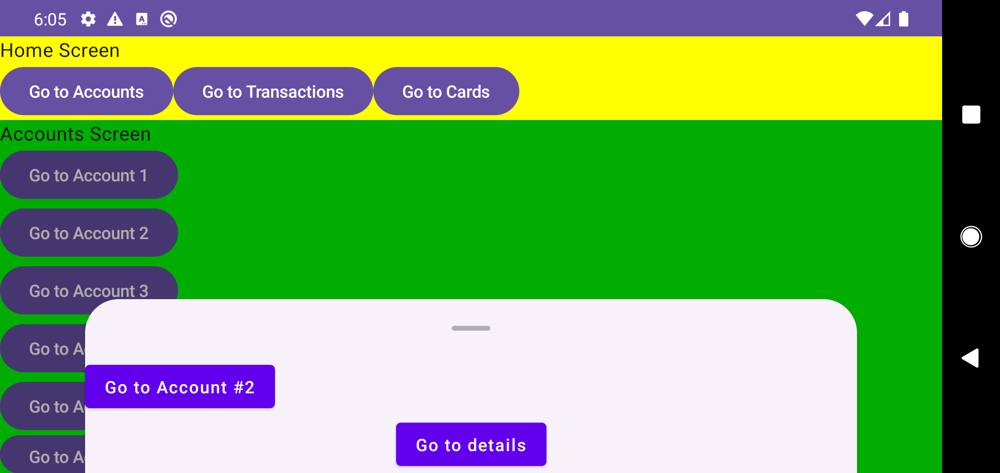

# Issue #17: per-entry UI state evidence

Эта проверка фиксирует lifecycle локального Compose UI state по exact `BackStackEntry.id`: state сохраняется для entry, пока он остаётся в полной navigation history, переживает смену layout projection и Activity recreation, изолирован от одинакового route с другим ID и освобождается после `Pop`.

## Окружение

Проверка выполнена на отдельном `emulator-5560`, AVD `Pixel_4`, API 29. Общий `emulator-5554` не запускался, не выбирался и не изменялся. Maestro обнаружил только `emulator-5560`; production flow и кадр ниже выполнены адресно на нём.

## JDK 17 quality gate

```bash
./gradlew testDebugUnitTest lintDebug assembleDebug assembleDebugAndroidTest
```

Результат: `BUILD SUCCESSFUL`. JVM suite содержит 174 теста в 17 suites, без failures, errors или skips. Контракты target-а отдельно отклоняют пустую history, blank/duplicate history IDs, видимые IDs вне history и повтор одного visible ID в разных slots.

## Полный instrumentation gate

```bash
adb -s emulator-5560 shell am instrument -w -r \
  com.shmakov.udf.test/androidx.test.runner.AndroidJUnitRunner
```

Результат:

```text
Time: 48.223

OK (38 tests)
```

В gate входят один `MainActivityBackRegressionTest`, три `MainActivityRestorationRegressionTest`, девять `AnimatedNavigationRegressionTest`, тринадцать `BottomSheetLayoutRegressionTest` и двенадцать `EntrySaveableStateRegressionTest`.

Новые regression cases проверяют:

- `rememberSaveable` после перехода away/back и удаление bucket после exact `Pop`;
- независимый state одинаковых routes с разными entry IDs;
- сохранение hidden entry при single-pane projection и перенос root ↔ nested без второго provider-а;
- Activity recreation с теми же stable IDs;
- typed binding failure без преждевременной очистки уже принятого state;
- реальный binding-failure frame сбрасывает только физическую outgoing-ветку и не позволяет её modal exit воскреснуть после recovery;
- interrupted relocation/removal без одновременного запуска одного provider-а;
- modal ABA, глубокую direct ↔ nested relocation и перенос глубокого modal owner-а через замену root.

Последние сценарии сначала воспроизводили реальные RED-регрессии: потерю state после временной binding failure, повторное использование stale outgoing ownership после failure/recovery, двойной вызов saveable provider-а, resurrection/двойное владение modal и исчезновение retained modal без `Hidden` при cross-root relocation. Исправления принимались только после перехода этих тестов в GREEN и полного gate.

## Production UI flow

Maestro выполнил clean launch, поворот в landscape, дождался `Home Screen`, перешёл в видимый `Accounts Screen`, открыл account modal, проверил controls `Go to Account #2` и `Go to details`, дождался завершения анимаций и снял кадр. После открытия modal accessibility tree содержит root `Home Screen` и modal controls; nested `Accounts Screen` остаётся видимым на финальном кадре, но исключён Material modal-слоем из активного semantics tree.

[](retained-entry-presentation.png)

Кадр подтверждает финальную production-композицию и placement трёх navigation levels. Сам lifecycle saveable state доказывается instrumentation-тестами выше: статичный скриншот не может доказать сохранение значения после скрытия, recreation или освобождение после `Pop`.

Граница проверки: Activity recreation покрыта, но реальный OS process kill для per-entry UI state здесь не заявлен. Отсутствие лишних parent recompositions также вынесено в отдельный измеримый [issue #28](https://github.com/senneco/udf-sandbox/issues/28).
