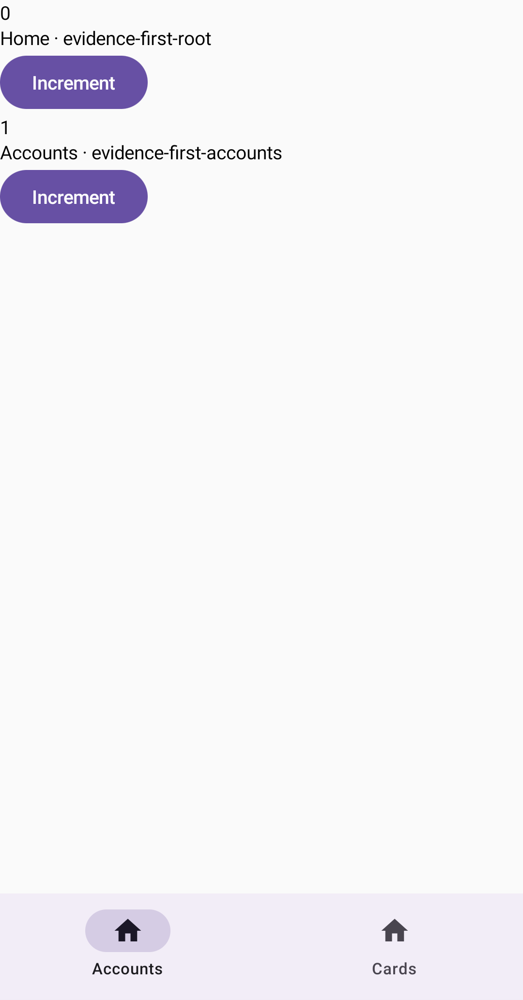
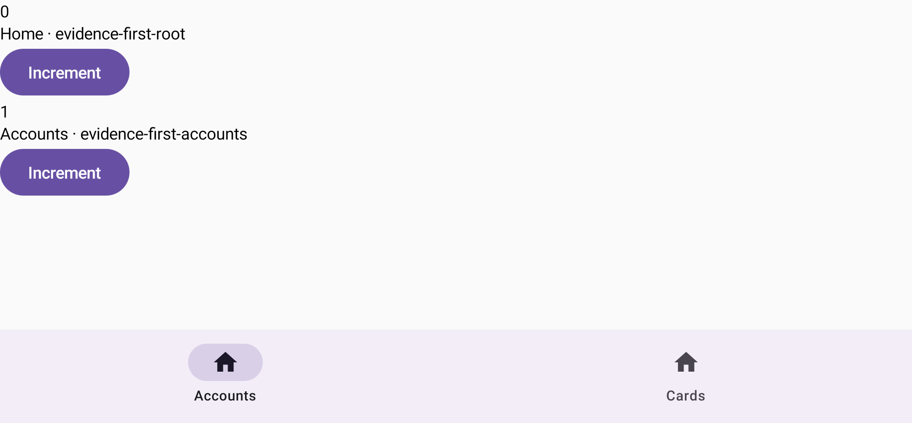

# Issue #52: stateful tabs Compose sample evidence

Этот slice добавляет internal app-side `DemoTabNavigation`: durable tab graph остаётся единственным
источником порядка, выбора и независимых leaf histories, а application catalog задаёт только label
и icon. Selected history проходит существующие `NavProjector` и `AnimatedNavigation`; один
`EntrySaveableStateHost` удерживает exact graph-wide `EntryId` неактивных tabs.

## Device boundary

Проверка выполнена только на отдельном self-owned `emulator-5582`, AVD `Pixel_4`, API 29. Shared
emulator не запускался, не выбирался и не изменялся. Sample не подключён к `MainActivity`, поэтому
кадры и device suite доказывают Activity-independent Compose fixture, но не launch/recreation или
реальный OS process death tab graph.

## Stateful journey

Один deterministic instrumentation journey строит две нетривиальные истории, меняет
`rememberSaveable` value в обеих ветках, выполняет `A → B → A` и перед capture проверяет, что первая
ветка вернулась с exact value `1`. Тот же journey выполнен в portrait и landscape.

[](stateful-tabs-portrait.png)

[](stateful-tabs-landscape.png)

Статические PNG показывают финальную композицию и tab selection. Независимость histories,
graph-wide entry retention, stale callback guards, cleanup и отсутствие лишних committed passes
доказываются assertions, а не изображением. Перед каждым capture manual clock переключался в
auto-advance, Compose дожидался idle и повторно проверял exact selected semantics и сохранённое
значение; поэтому кадры не содержат незавершённый indicator или press/ripple.

## Regression coverage

- exact `A → B → A` histories, entry IDs и независимые saveable values;
- equal route types в разных tabs не делят UI state;
- tab tap всегда отправляет exact `Select`, а reselect остаётся reducer-owned `Unchanged`;
- outgoing physical callback сохраняет старые `tabId + topEntryId` после switch/`ReplaceGraph`,
  включая same-tab замену top и callback уже exiting modal;
- tab switch удаляет старую modal presentation snap: committed-state ledger доказывает, что слой
  ни разу не перешёл в `Hidden` exit;
- reducer-driven leaf push отрисовывает incoming leaf, не создавая committed pass tab bar,
  неизменившегося внешнего parent или inactive tab;
- nested local state не создаёт committed pass shell, tab bar, stable parent или inactive tab;
- integrated manual-clock oracle отличает физический leaf motion от более быстрого snap при
  `Select` и `ReplaceGraph`, не используя фиксированную длительность;
- `ReplaceGraph` очищает retired saveable bucket: test-only повтор exact старого `EntryId`
  начинает с default `0`, а retained tab сохраняет `2`;
- missing visual config отклоняется до tab item и destination composition.

## Quality gates

Полный project gate выполнен на JDK 17 с принудительным повтором JVM tests:

```bash
./gradlew -Dorg.gradle.java.home=<jdk-17> \
  testDebugUnitTest --rerun-tasks lintDebug assembleDebug assembleDebugAndroidTest
```

Результат: `BUILD SUCCESSFUL`; 280 JVM tests в 31 suite, failures/errors/skips — 0; lint и оба
APK собраны. Полный device gate выполнен адресно:

```bash
ANDROID_SERIAL=emulator-5582 ./gradlew \
  -Dorg.gradle.java.home=<jdk-17> connectedDebugAndroidTest
```

Результат: `BUILD SUCCESSFUL`; 64 instrumentation tests, failures/errors/skips — 0. Тринадцать
новых tab tests сначала запускались отдельно, затем вошли в этот полный gate. Два screenshot journey
запуска дополнительно прошли по одному разу после portrait/landscape rotation и перед каждым PNG
проверили exact selected semantics (`Accounts` selected, `Cards` not selected).
